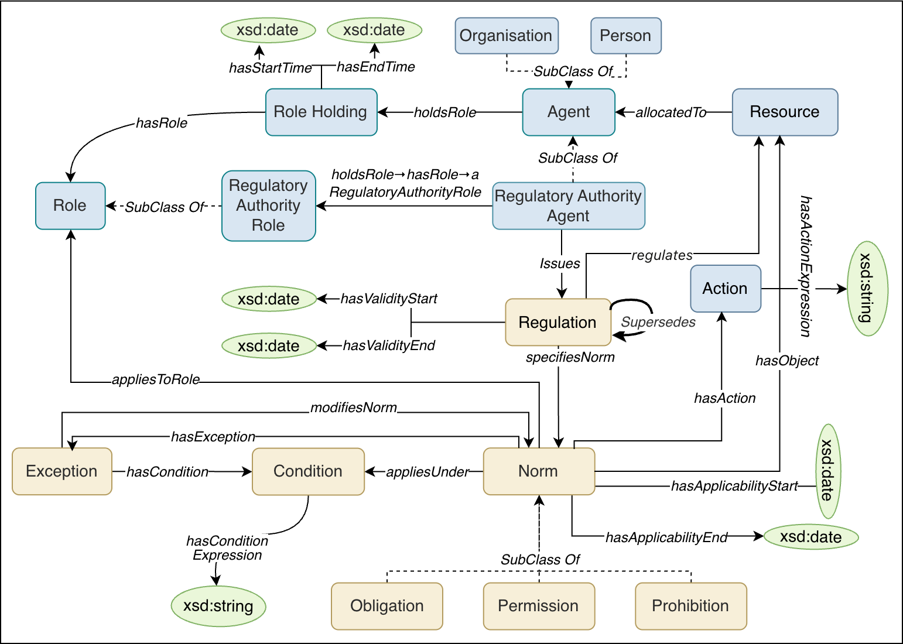
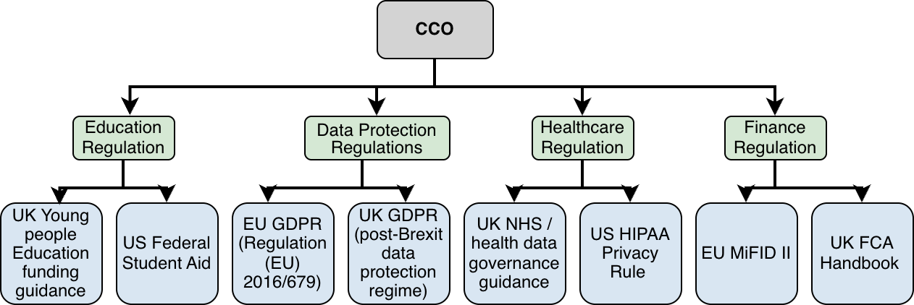

# Core Compliance Ontology (CCO)

CCO, a domain- independent ontology that captures commonly occurring structural patterns found in existing compliance ontologies, including norms and their deontic types, prescribed actions, applicability conditions, exceptions, role-based applicability, and temporal scope. CCO also models the agents and roles involved in issuing and complying with regulations. A two-stage evaluation strategy is used: first, competency question-based SPARQL verification checks that the required modelling patterns are present in the CCO schema; second, an LLM-assisted cross-domain evaluation examines whether clause-level requirements from four compliance domains can be structurally represented using CCO.

## Documentation

Full ontology documentation is available at:
**https://www.w3id.org/cco/cco**


---

### CCO Conceptual Model
<div align="center">

</div>

*Figure 1: The Core Compliance Ontology (CCO) conceptual model. Beige nodes represent normative classes (regulations, norms, conditions, exceptions, and deontic types), blue nodes represent contextual classes (agents, roles, role holdings, actions, and resources), and green ellipses represent datatype values.*

### CCO Layered Architecture
<div align="center">

</div>


*Figure 2: Intended layered use of CCO, showing domain-specific extensions instantiated with representative regulations from different compliance domains.*

### GDPR Article 33 Instantiation Example
<div align="center">

</div>


*Figure 3: CCO instantiation of selected requirements from GDPR Article 33 Nodes represent CCO individuals, with their types shown in brackets. Literal text values represent datatype values. Italic labels denote CCO properties. Dashed arrows denote cco:modifiesNorm links from exceptions to the norms they modify.*

---

## Repository Structure

```
CCO/
  CCO.ttl                      # The core CCO ontology in OWL/Turtle format, defining all classes, properties, and axioms
CCO-BFO-Alignment/
  CCO-BFO-Alignment.ttl        # Alignment ontology that imports CCO and defines alignments between CCO concepts and BFO and NRV.
                               # Requires CCO to be imported alongside this ontology.
  README.md
CCO-Education-Usecase/
  CCO-Education.ttl             # The CCO education domain extension, defining education-specific role classes and alignments to EFRO
  CCO_V1.ttl                   # Local copy of the core CCO ontology used as a dependency in the education extension
  catalog-v001.xml              # Ontology catalog file mapping imported IRIs to local file paths for the education extension
  imports/
    efro_module.owl             # A selected extract of EFRO classes used for alignment
  README.md
Evaluation/
  Stage 1 Evaluation/
    CQ Based SPARQL Verification.md  # The 20 competency questions and corresponding SPARQL ASK and SELECT queries
  Stage 2 Evaluation/
    Step 1/
      LLM generated CQs/       # Generated competency questions per domain
      dataset/                 # Regulatory documents used for CQ generation
      CQs Evaluation.csv       # LLM assessment results CQs
      Generation.ipynb         # CQ generation pipeline notebook
      Human_Evaluation.csv     # Human reviewer evaluation results for a stratified random sample of 240 CQs
      README.md
    Step 2/
      abox-sparql results/     # Generated ABox instance data (TTL) and SPARQL queries for each evaluated provision
      ABox and Sparql generation and evaluation.ipynb  # ABox generation and SPARQL evaluation notebook
      cco_shapes.ttl           # SHACL shapes file for validating ABox instances against CCO
      validation_results.csv   # Results of SHACL validation and SPARQL evaluation across all competency questions
      README.md
Ontology Design Pattern/
  design-patterns.md            # CCO modelling patterns
docs/                           # WIDOCO-generated ontology documentation
  index-en.html                 # Main documentation page
  index.html                    # Redirect to index-en.html
  figures/
    cco-model.png               # CCO conceptual model diagram (Figure 1)
    cco-layering.png            # CCO layered architecture diagram (Figure 2)
    gdpr-example.png            # GDPR Article 33 instantiation diagram (Figure 3)
LICENSE.md                      # CC-BY 4.0 licence
README.md                       # This file
```
---


## Evaluation

CCO was evaluated through a two-stage strategy:

**Stage 1: Competency Question-Based SPARQL Verification**

Twenty competency questions (CQs) were defined to assess whether CCO provides the vocabulary required to represent its seven modelling patterns, organised into five categories: agent and role, norm and regulation, temporal scoping, exception and condition, and resource allocation. For each CQ, two SPARQL queries are provided: a SPARQL ASK query verifying schema-level axioms against the CCO TBox, and a SPARQL SELECT query demonstrating how the question can be answered against instance data. The full set of CQs and queries is available in `Evaluation/Stage 1 Evaluation/CQ Based SPARQL Verification.md`.

**Stage 2: LLM-Assisted Cross-Domain Evaluation**

An LLM-assisted cross-domain evaluation was conducted across four compliance domains (education funding, finance, healthcare, data protection). Of 1,587 generated competency questions, 1,556 (98.1%) were assessed as supported by CCO. A 10% sample of 156 CQs was further validated: 154 (98.7%) passed SHACL validation and 142 (91.0%) returned a non-empty SPARQL result.

---

## Domain Extension

A lightweight education domain extension is provided in `Usecase/CCO-Education/`, demonstrating how CCO can be extended. EFRO classes are aligned to CCO via `rdfs:subClassOf` and thirteen education-specific role classes are defined as subclasses of `cco:Role`.

---

## License

This ontology is licensed under the Creative Commons Attribution 4.0 International License (CC-BY 4.0).

---

## Citation

```
Arshad, U., Corsar, D., Nkisi-Orji, I.: CCO: A Core Compliance 
Ontology for Modelling the Normative Structure of Regulations. 
Available at: https://github.com/RGU-Computing/CCO
```
