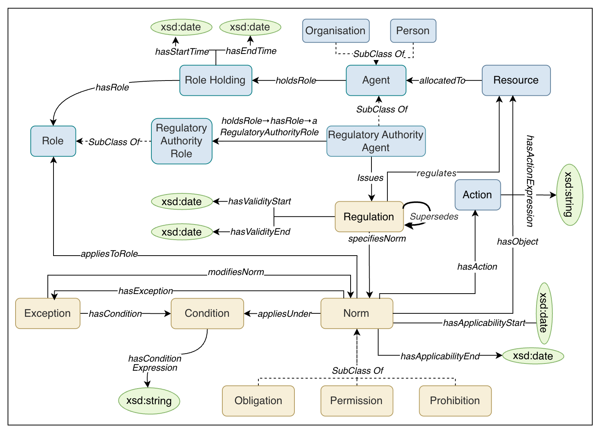
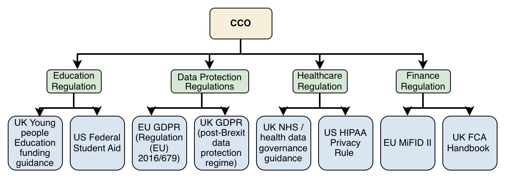
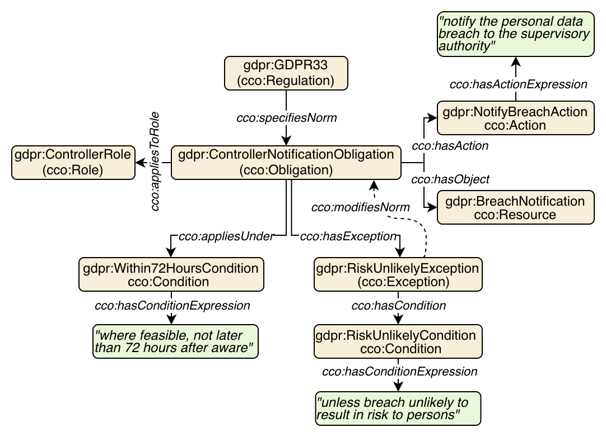

# Core Compliance Ontology (CCO)

CCO is a domain-independent ontology for representing the regulatory structure of regulations. It provides a reusable scaffold for capturing recurring normative patterns across compliance domains, including obligations, permissions, prohibitions, conditions, exceptions, role-based applicability, and temporal scope.

## Documentation

Full ontology documentation is available at:
**https://rgu-computing.github.io/CCO/**

Permanent identifier: **https://www.w3id.org/cco/cco**

---

### CCO Conceptual Model
<div align="center">

</div>
*Figure 1: The Core Compliance Ontology (CCO) conceptual model. Beige nodes represent normative classes (regulations, norms, conditions, exceptions, and deontic types), blue nodes represent contextual classes (agents, roles, role holdings, actions, and resources), and green ellipses represent datatype values.*

### CCO Layered Architecture
<div align="center">

</div>

*Figure 2: Intended layered use of CCO, showing domain-specific extensions grounded in CCO and instantiated with representative regulations from different compliance domains.*

### GDPR Article 33 Instantiation Example
<div align="center">

</div>
*Figure 3: CCO instantiation of selected requirements from GDPR Article 33, paragraphs 1 and 2. Beige nodes represent CCO individuals, green nodes represent plain text datatype values, and dashed arrows denote cco:modifiesNorm links.*

---

## Repository Structure

```
CCO/
  CCO.ttl                      # The core CCO ontology in OWL/Turtle format, defining all classes, properties, and axioms
  CCO.properties                # Protégé project properties file for the core ontology

CCO-BFO-Alignment/
  CCO-BFO-Alignment.ttl        # Alignment ontology between CCO and BFO and NRV. 
                               # Requires CCO to be imported alongside this ontology.

Usecase/CCO-Education/
  CCO-Education.ttl             # The CCO education domain extension, defining education-specific role classes and alignments to EFRO
  CCO-Education.properties      # Protégé project properties file for the education extension
  CCO_V1.ttl                   # Local copy of the core CCO ontology used as a dependency in the education extension
  catalog-v001.xml              # Ontology catalog file mapping imported IRIs to local file paths for the education extension
  imports/
    efro_module.owl             # A lightweight EFRO module extracted using the MIREOT method via the ROBOT tool, containing selected EFRO terms
    efro_module.properties      # Properties file for the EFRO module

Evaluation/
  stage1-cqs.md                 # The 20 competency questions and corresponding SPARQL ASK queries used in Stage 1 evaluation

docs/
  figures/
    cco-model.png               # CCO conceptual model diagram (Figure 1)
    cco-layering.png            # CCO layered architecture diagram (Figure 2)
    gdpr-example.png            # GDPR Article 33 instantiation diagram (Figure 3)

LICENSE.md                      # CC-BY 4.0 licence
README.md                       # This file
```


## Evaluation

CCO was evaluated through a two-stage strategy:

**Stage 1:** 20 competency questions were verified using SPARQL ASK queries against the CCO TBox, confirming correct implementation of classes, properties, and schema-level axioms across five categories: agent and role, norm and regulation, temporal scoping, exception and condition, and resource allocation. The full set of CQs and SPARQL queries is available in `Evaluation/stage1-cqs.md`.

**Stage 2:** An LLM-assisted cross-domain evaluation was conducted across four compliance domains (education funding, finance, healthcare, data protection). Of 1,587 generated competency questions, 1,556 (98.1%) were assessed as supported by CCO. A 10% sample of 156 CQs was further validated: 154 (98.7%) passed SHACL validation and 142 (91.0%) returned a non-empty SPARQL result.

---

## Domain Extension

A lightweight education domain extension is provided in `Usecase/CCO-Education/`, demonstrating how CCO can be extended. Eleven EFRO classes are aligned to CCO via `rdfs:subClassOf` and thirteen education-specific role classes are defined as subclasses of `cco:Role`.

---

## License

This ontology is licensed under the Creative Commons Attribution 4.0 International License (CC-BY 4.0).

---

## Citation


```
Arshad, U., Corsar, D., Nkisi-Orji, I.: CCO: A Core Compliance Ontology for Modelling the Normative Structure of Regulations. GitHub repository, 2026. Available at: [https://github.com/RGU-Computing/CCO]
```
